# What's The Weather

 

## Table of contents

In order to smoothly jump through the documentation sections, use the "list" icon on the top-left side of the page screen. 

1. [*Introduction*](#introduction)
2. [*History*](#history)
3. [*Walkthrough*](#walkthrough)
4. [*Extras*](#extras)
5. [*Conclusion*](#conclusion)

 

## Introduction

 

**Welcome to What’s The Weather official documentation !**

 

What’s The Weather is a website that allows you to check the weather conditions for more than 500.000 cities around the world. Find the accurate and precise forecast, including temperature, air humidity, wind speed and more. Check and compare how the weather changes over time with a comprehensive weather graph & table. You can also view the current weather if necessary.

 

## History

The origins of this project came from early April of 2021. I was taking very first steps into the back-end world, learning Express.js and basics of API usage. Around this time I had tried to pull off two other projects, which turned out not to be successful. As a matter of fact, neither of them were published. 

‘What’s The Weather’ was the third attempt. An idea for a weather app came from one of YouTube videos, showcasing how to use an example API. This little inspiration, combined with my contemporary experiments with dynamic HTML creation led me to work hard on the project development. This came beyond my limits in many aspects, posing as a real challenge to overcome.

First release of the project came roughly after 2 months of working on it - on June 3rd, 2021, the website got published. For a long time, ‘What’s The Weather’ remained as one and only finished project of mine. It did receive some minor quality updates, which were to enhance user experience. 

Over time, the website was not getting pretty much any new patches, which kept it on the same level, being less and less exciting. This made me think over the real reason behind that. There was no doubt that the almost 2-year-old app would deserve a solid remake. As a result, a new 2.0 version was published on April 19th, 2023, bringing back the same functionality, but with refreshed look and improved layout.

 

## Walkthrough

**The website is available under this URL address:** https://wtweather.glitch.me/

**Please note that the project might take some time to load. It is not dependent on the app itself, but rather on the Hosting Provider regulations.**

Once you visit ‘What’s The Weather’ website, you should see the main control panel - very similar to this one:

 

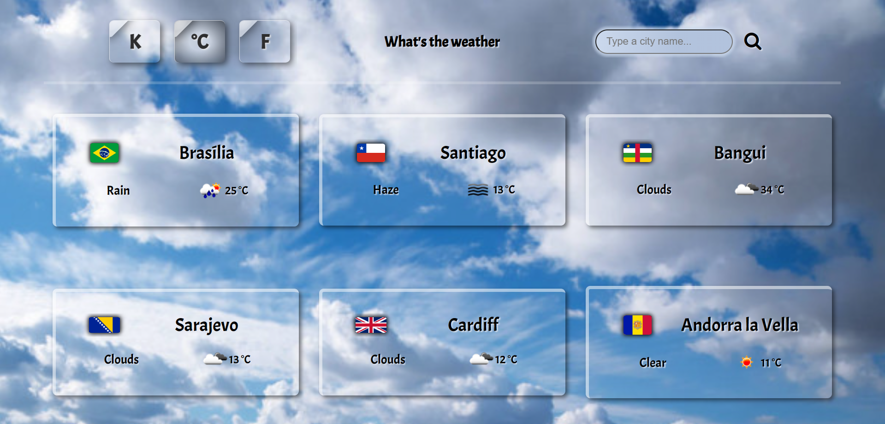

 

Here is the panel that allows you to check current weather for a chosen city. The moment you see it, there will already be a list of six boxes, each representing a random capital city. From the first perspective, there is basic information about each - a city name (with country flag that the city belongs to), current temperature and weather, provided by both one-word description text and respective icon. 

If you hover a mouse cursor over any of these weather boxes, you can see a change in the box background, which is a little accent to outline current weather in a city. Just take a look:

 

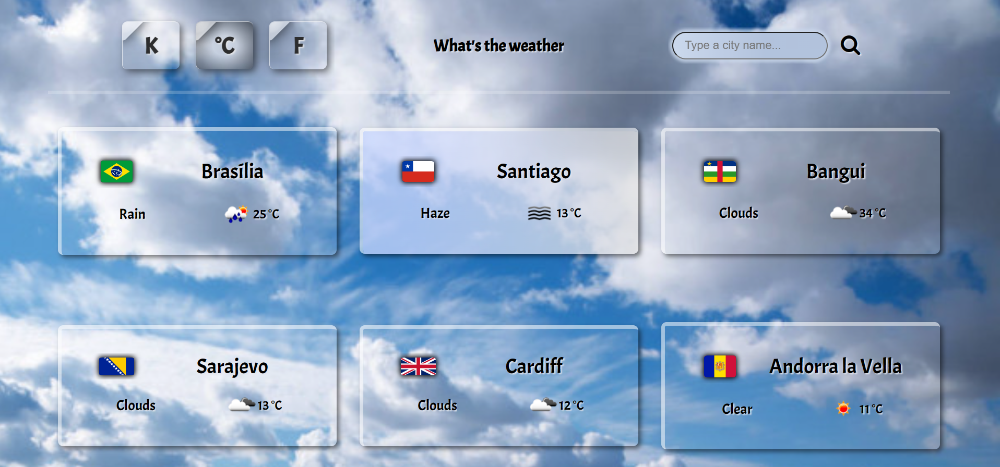

 

There is an option to click onto the weather box to read more useful data about the city and its weather, but for now let’s hold on for a moment. It’s useful to target capital cities, but what if we would like to get any other city ? For that purpose a search bar can be used. Let’s type a city name and confirm the choice with the “loop” button:

 

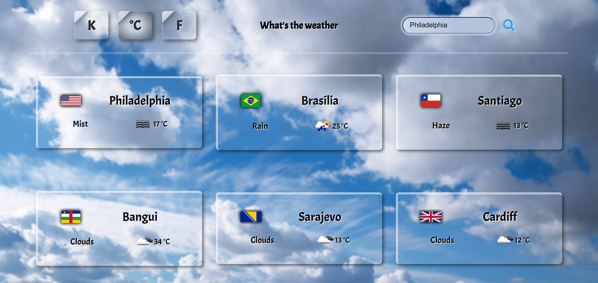

 

This way we can instantly get the current weather in any city you can think of. Note that every city box moves one place further from its previous position. This way we retained an empty place for the newly added city (Philadelphia, in above example), but because of that, a weather list no longer includes Andorra la Vella, which was the sixth city. You can of course look it up again to get it back, but this time Cardiff city will be moved away from the list:

 

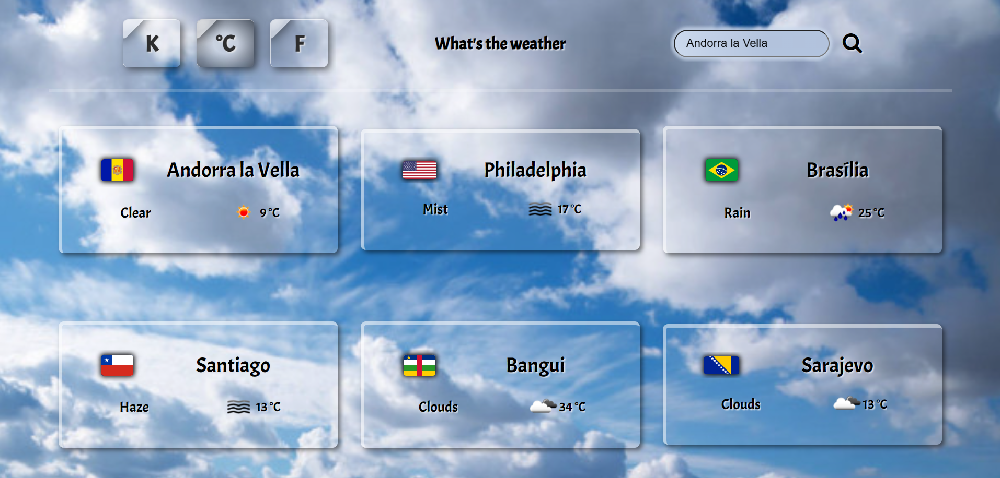

 

As a side note: if you try to add a given city to a list more than once - it will not work. A warning message will be thrown:

 

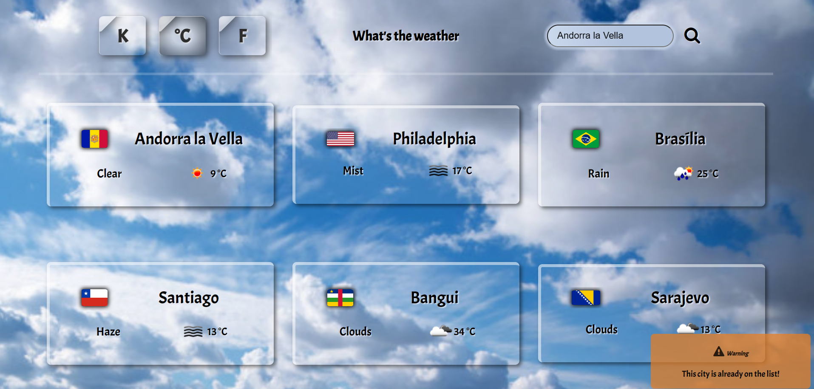

 

Also, if you type a city name - deliberately or not - that does not exist, an error message will be displayed:

 

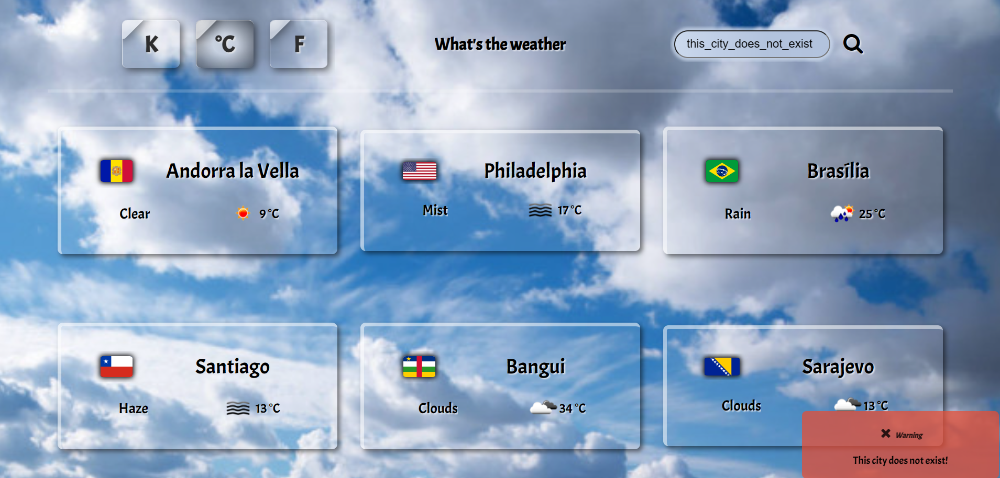

 

Let’s cover the last important aspect when it comes to searching for a city. Imagine we want to check the weather for Dublin - the capital city of Ireland. If we were to type ‘Dublin’, we get such result:

 

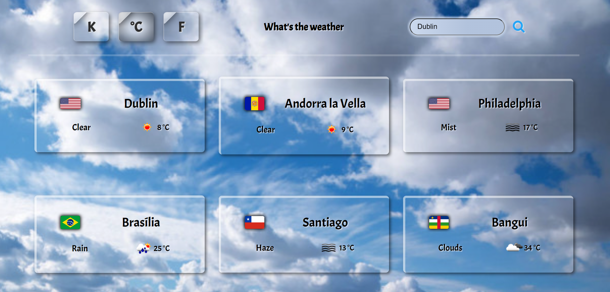

 

The flag does not resemble the Irish flag, but rather the US one. Did something go wrong ? Well, the problem is that there is also a Dublin city in the USA. How can we get the Irish capital city then ? To make it happen, a more specific query has to be put inside the search bar. Let’s also include an ISO country code (in case of Ireland, it is ‘IE’), separated by a comma character - just like this:

 

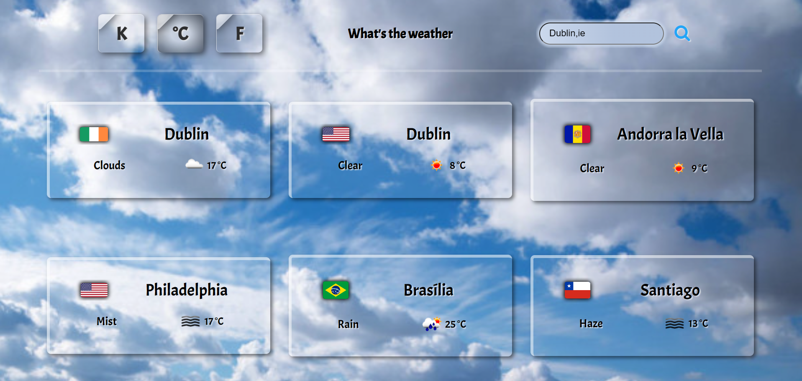

 

Got it ! Now let’s consider another use case of ISO code query. There is a small village in France, which name is exactly one letter long. If we try to type its name in the search box, we will get a bit falsy result: 

 

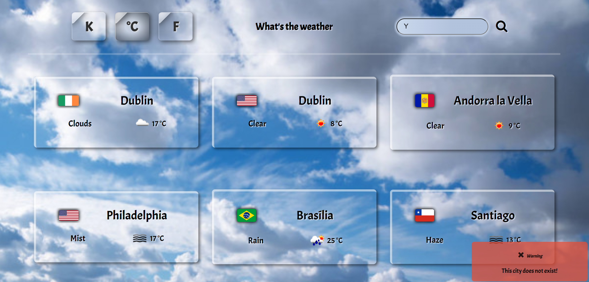

 

Let’s fix this issue by adding a comma and France ISO code right after it:

 

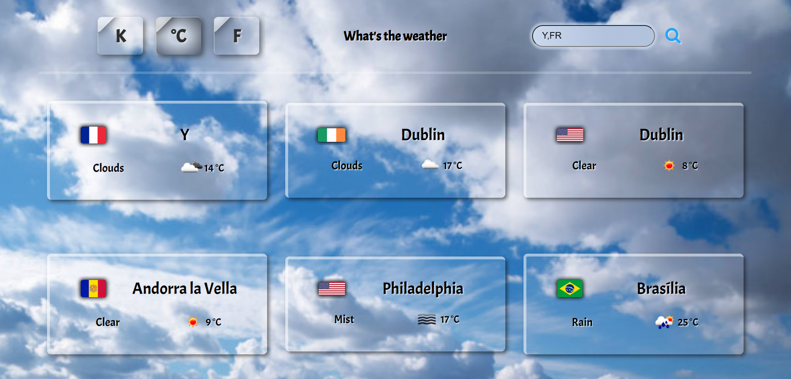

 

If you are willing the use ISO codes in city queries, feel free to use this table (*Extras*), where you can find all countries listed with its representative ISO code.

Lastly, there is a possibility to query countries as well. In below image, you can see Spain being targeted: 

 

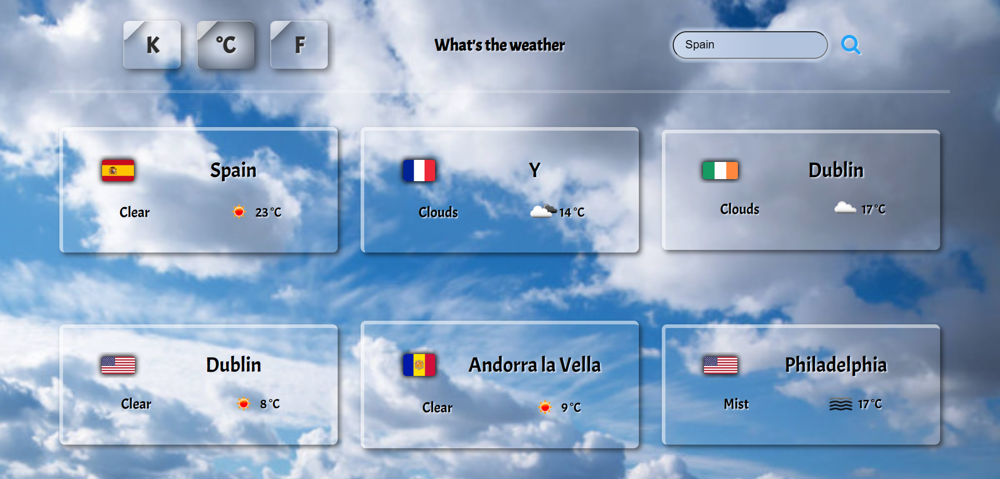

 

However, this is not a recommended approach. Targeting a country would make results less correct, because data is calculated as an average in the whole country, and it may differ if we are to take each city case individually.

The left hand side buttons are to switch the temperature unit shown. Once a button is clicked, it automatically recalculates a degrees value for all cities currently available on the list, and also ones added later. Take the unit that you feel the most comfortable with. And with that little customization set up, we can now choose the weather box (by simply clicking onto it) and move to a detailed weather page:

 

1)

 

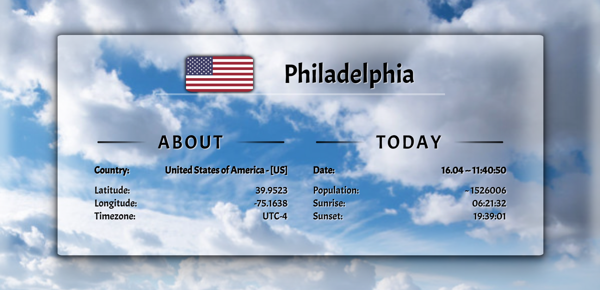

 

This is the first feature of a detailed weather page for every country. Here we can find some useful pieces of information about the city location and current weather there. Its role is purely informative, and it is not possible to interact with the box in any way. 

See that all hours provided in this, and any other section of the detailed page, has the time converted to represent a daytime of the queried city. Hence, do not get confused by the fact that the hour represented in the Date tab for a city will not represent your current time (unless the queried city is located in the same time zone). 

**NOTE: City population count might be outdated in some cases. Do not take this single piece of information here as a granted and 100% correct source.**

 

2)

 

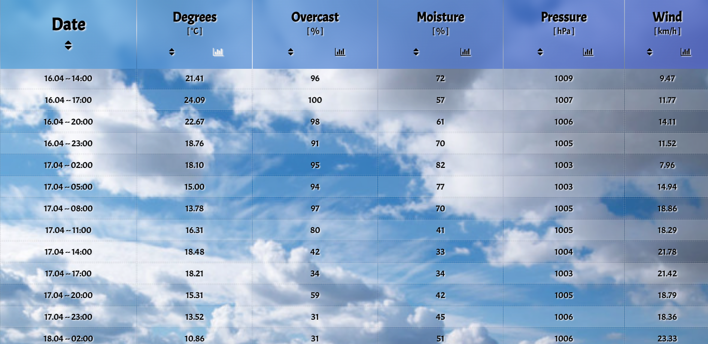

 

This is a detailed weather table for a chosen city. Here you can find 40 weather entries, containing highly precise data sets about:
- temperature (expressed in a unit that you previously picked from the main page),
- overcast level (expressed in percentage value - **%**),
- moisture level (expressed in percentage value - **%**),
- pressure (expressed in hectopascals - **hPa**),
- wind speed (expressed in kilometers per hour - **km/h**)  

Between each entry there is an interval of 3 hours. In total, there are 40 entries, which means that the table is providing a detailed forecast for 5 days.

There are also two action buttons for each table section (except for Date, which has only one). Let’s break down their functionality:

**Triangle arrows** - once clicked, a table is being sorted by a given criteria. When clicked for the new table category, it changed focus by sorting category values in ascending order. By pressing once again, the sorting method is changed to descending order. This button can be freely toggled and changed between different categories to adjust the sorting way that fits your needs.

**Graph icon** - creates a graph that visualizes a given category in a graph format. The graph can be found below the weather table. By default, the graph represents the degrees (temperature) category, however the category can be changed at any time.

 

3)

 

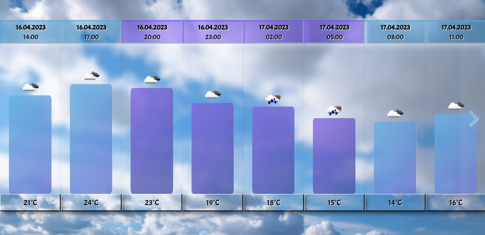

 

Weather graph is a visualizer for a chosen category. It behaves as an addition to a table section. It is simply the same data, but with rounded decimal values, and represented in more friendly and readable format.

You can browse through the graph, which is always sorted in chronological order, and looks for the change over time. The graph represents 40 separate records, and You can look for next or previous  records by switching currently viewed ones with respective arrow boxes (located at the edges of the graph).

 

4)

 

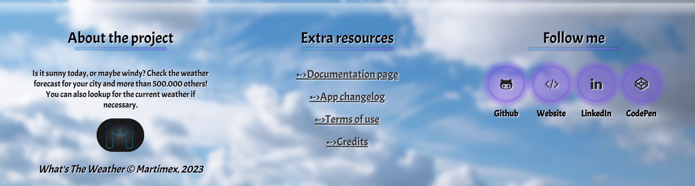

 

Footer section - here you can find some extra pieces of information related to the project (links available in ‘Extra resources’ part). You can refer to the documentation page (the one you are checking one) or check the ‘Changelog’, to track recent changes made for the website. I highly encourage you to read Terms of use (the project license). For curious, a Credits page is where you can see all the tools I used to create the ‘What’s The Weather’ website.

 

## Extras

**ISO Country codes table**

 

[Check this ISO 3166 codes table](https://en.wikipedia.org/wiki/List_of_ISO_3166_country_codes)

 

**NOTE: ISO 3166-1 with Alpha-2 codes works correctly, make sure to take advantage of them**

 

## Conclusion

First of all, thanks for checking out What’s The Weather documentation page. I hope you enjoyed it as much as me creating it !

This project, despite being already reworked, is still going to receive some updates soon. Once I find the right time and gain some extra skill, I won’t hesitate to experiment with some fresh updates to the project.

 

© Martimex 2023

